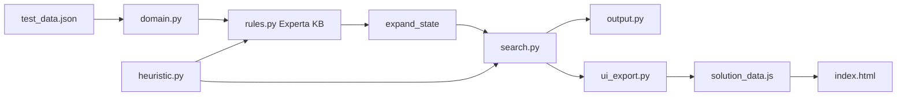

# Architecture

## High-level flow



1. **domain.py** reads JSON and builds items, load candidates, constants.
2. **search.py** maintains a frontier of states and calls **expand_state** for each expansion.
3. **expand_state** runs Experta rules on a `CurrentState` fact and collects `GeneratedState` successors.
4. **output.py** runs A\*, writes `solution_data.js`, prints path and search tree sample.
5. **index.html** loads `solution_data.js` and replays the solution.

## File reference

| File | Role |
|------|------|
| `flower_robot_kbs.py` | Entry point; calls `output.main()` when run as script |
| `domain.py` | Problem data model, `ITEMS`, `LOAD_CANDIDATES`, `MAX_LOAD`, `State`, `Node`, `Result` |
| `facts.py` | Experta `Fact` subclasses (`Grid`, `Robot`, `CurrentState`, `GeneratedState`, …) |
| `rules.py` | `FlowerRobotKB` — all generation, constraint, goal, and tree rules |
| `heuristic.py` | Manhattan-distance heuristic `h(n)` |
| `search.py` | Iterative A\* and DFS over rule-generated successors |
| `utils.py` | Tuple helpers (`all_zero`, `leq_tuple`, `sub_tuple`, `unique`, `choose`) |
| `output.py` | Console reporting and orchestration |
| `ui_export.py` | Builds replay states for the HTML visualizer |
| `index.html` | Dark-themed grid replay UI |
| `solution_data.js` | Generated; do not edit by hand |
| `requirements.txt` | `experta==1.9.4` |

## Domain model (`domain.py`)

### `Item`

One bouquet demand line:

```python
Item(pavilion, flower, color, count, pos)
```

All lines are flattened into `ITEMS` — a fixed-order tuple used for `remaining` and `cargo` vectors.

### `State` / `Node` / `Result`

- **State** — snapshot for search.
- **Node** — state + `g` (path cost) + `path` (action sequence).
- **Result** — final `Node` + `generated` (search tree lines).

### Load candidates

`build_load_candidates()` precomputes every valid batch:

- For each pavilion: all needs for that pavilion (same flower).
- For each color: all remaining lines of that color across pavilions (same color).
- Filtered by `valid_batch()` (capacity + same-flower OR same-color).

## Experta integration

Rules do **not** run the full search alone. Pattern:

```python
expand_state(x, y, remaining, cargo, g, path):
    kb = FlowerRobotKB()
    kb.declare(CurrentState(...))
    kb.run()  # rules fire → GeneratedState + TreeLine facts
    return successors, tree_lines, solution
```

`search.py` chooses **which** expanded state to explore next (A\* vs DFS).

## UI export (`ui_export.py`)

Replays the solution path into step-by-step states:

- Position after each move
- Cargo after load/unload
- Cumulative delivered counts
- Cost `g(n)` at each step

Written to `window.FLOWER_ROBOT_DATA` in `solution_data.js`.

## Design choices

| Choice | Reason |
|--------|--------|
| Tuple vectors for cargo/remaining | Fixed schema; easy equality for duplicate detection |
| Precomputed `LOAD_CANDIDATES` | Avoid regenerating batches on every expansion |
| Experta per expansion | Matches assignment: rules generate successors |
| Python frontier for A\* | Reliable ordering by `f(n)`; rules supply successors and `h` |
| Separate `heuristic.py` | Clear explanation for oral exam |

## Dependencies

- **Python 3.10+** (match/case syntax in several modules)
- **experta 1.9.4** — requires `collections.Mapping` patch in `rules.py` for Python 3.10+
